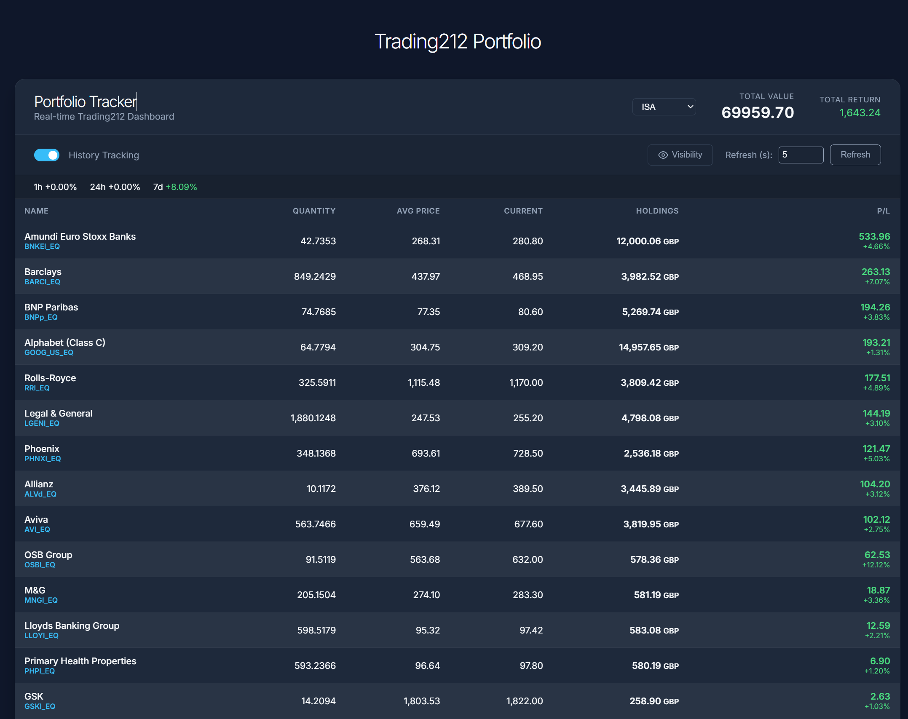
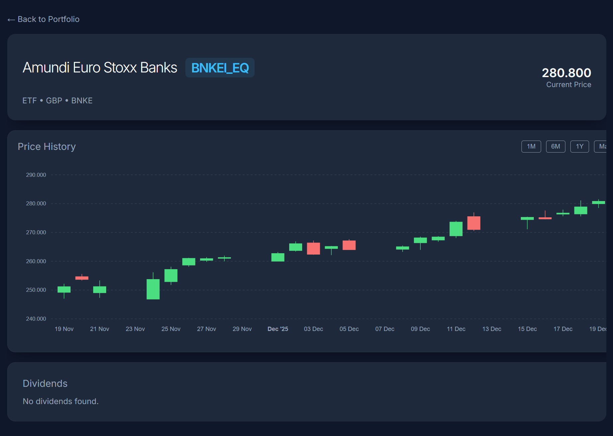

# Trading212 Portfolio Tracker
# hello world

A dashboard for tracking Trading212 portfolio performance, visualizing holdings, and monitoring historical returns.


## Features






*   **Real-time Dashboard**: View current positions, quantities, and profit/loss in real-time.
*   **Historical Tracking**: Background service automatically records portfolio value over time to `portfolio_history.db`.
*   **Performance Metrics**: Calculate TWR (Time-Weighted Returns) and other performance statistics.
*   **Modular Architecture**: Built with Flask Blueprints for scalability and maintenance.
*   **Integration Testing**: Comprehensive API testing using Ruby RSpec.
*   **CI/CD**: Automated testing pipeline configured with CircleCI.

## Tech Stack

*   **Backend**: Python 3.11+, Flask, SQLite
*   **Frontend**: HTML5, CSS3, Vanilla JavaScript (ES6+)
*   **Testing**: Ruby RSpec, HTTParty
*   **DevOps**: CircleCI, GitHub Actions compatible

## Prerequisites

*   Python 3.11 or higher
*   Ruby 3.0+ (for running tests locally)
*   A Trading212 API Key (Demo or Live)

## Installation

1.  **Clone the repository**:
    ```bash
    git clone https://github.com/dynamohum/trading212-tracker.git
    cd trading212-tracker
    ```

2.  **Install Python dependencies**:
    ```bash
    pip install -r requirements.txt
    ```

3.  **Configure Credentials**:
    *   Create a file named `api` in the root directory (this file is git-ignored).
    *   Add your credentials in the following format:
        ```text
        TRADING212_API_KEY=your_api_key_here
        TRADING212_API_SECRET=your_api_secret_here
        TRADING212_MODE=demo  # or 'live'
        ```
    *   *Alternatively, set these as environment variables.*

    *   See https://docs.trading212.com/api/ for more details

## Running the Application

Start the Flask application:

```bash
python run.py
```

The application will start at `http://localhost:5000`.

*   **Dashboard**: `http://localhost:5000/`
*   **API Docs**: `http://localhost:5000/api/positions` (etc.)

## Running Tests

This project uses **RSpec** for black-box integration testing against the running API.

1.  **Install Ruby dependencies**:
    ```bash
    gem install bundler
    bundle install
    ```

2.  **Start the app** (in a separate terminal):
    ```bash
    python run.py
    ```

3.  **Run the tests**:
    ```bash
    bundle exec rspec
    ```

## Project Structure

```
├── app/
│   ├── routes/         # Flask Blueprints (main, api, ticker)
│   ├── services/       # Business logic (trading212, tracker, returns)
│   ├── database/       # Database manager
│   ├── utils/          # Helper functions
│   └── __init__.py     # App factory
├── static/             # CSS and JavaScript assets
├── templates/          # HTML templates (Jinja2)
├── spec/               # RSpec integration tests
├── .circleci/          # CI/CD configuration
├── client.py           # Raw API Client class
├── run.py              # Application entry point
└── requirements.txt    # Python dependencies
```

## License

MIT
